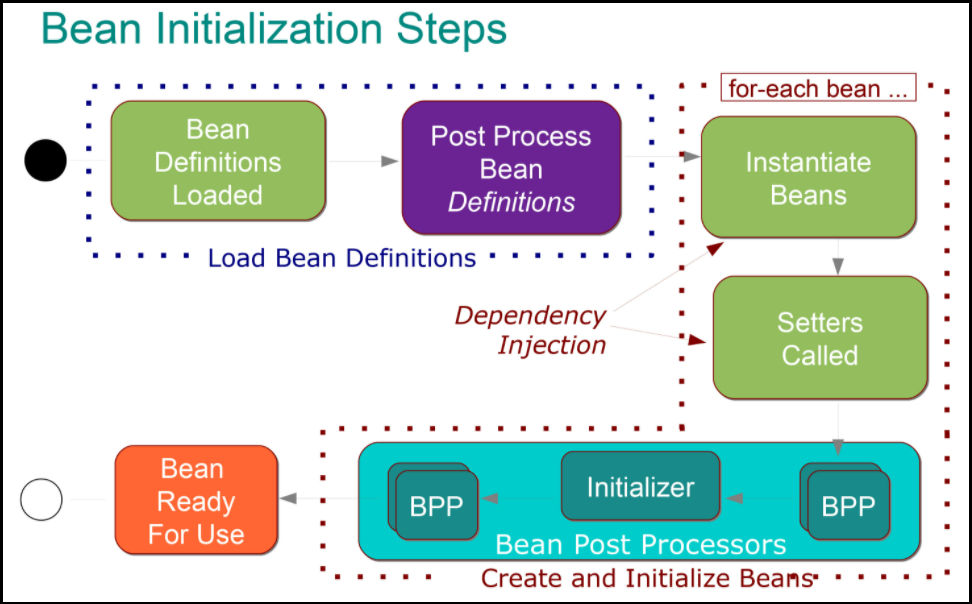

# [←](./README.md) <a id="home"></a> Spring IoC basics

## Table of Contents:
- [Intro](#intro)
- [Application Context](#context)
- [Spring Beans](#beans)
- [Bean scopes](#scopes)
- [Dependency Injection](#injection)
- [Properties injection](#properties)
- [Proxies](#proxy)
- [Spring Events](#events)
- [Resources](#resources)
----

## [↑](#home) <a id="intro"></a> Intro
Согласно отчётам **"[Java Developer Productivity Report](https://www.jrebel.com/resources/papers-and-videos)"** от JRebel, наиболее популярной "экосистемой" для разработки на Java является Spring Framework.

Основа Spring Framework - **[Spring IoC container](https://docs.spring.io/spring-framework/docs/current/reference/html/core.html#spring-core)**. Про него и пойдёт речь.

Сейчас Spring Framework ориентирован на **"[Spring Boot](https://docs.spring.io/spring-boot/docs/current/reference/html/getting-started.html#getting-started)"**, поэтому управление необходимыми зависимостями сейчас реализовано тоже на стороне Spring Boot. Spring Boot подключается при помощи специальных плагинов к проектам под управлением разных систем сборок: Maven, Gradle и Ant.

Для создания минимального описания проекта для Maven нам достаточно создать XML файл объектной модели проекта (**Project Object Model**) с указанием **[Maven coordinates](https://maven.apache.org/pom.html#Maven_Coordinates)**:
```xml
<project>
    <modelVersion>4.0.0</modelVersion>
    <groupId>com.github.veselroger</groupId>
    <artifactId>spring-ioc</artifactId>
    <version>1</version>
</project>
```
Данный файл должен быть сохранён с именем **pom.xml**. Установив Maven можно выполнить простейшую команду ``mvn validate`` чтобы проверить, что файл описания проекта не содержит ошибок.

Первое что нужно сделать - подключить сторонний pom.xml к нашему проекту, чтобы добавить описания версий. Это позволит свести к минимуму риски конфликтов версий различных частей экосистемы Spring.
Скопировать можно из документации: **"[Using Spring Boot without the Parent POM](https://docs.spring.io/spring-boot/docs/current/maven-plugin/reference/htmlsingle/#using.import)"**.

После базовых настроек нам нужно подключить сам Spring Boot. Он разделён на различные артефакты, каждый из которых обеспечивает определённую функциональность. Каждая такая часть мира Spring Boot подключается в проект при помощи "стартеров". Подробнее с их списком можно ознакомиться в документации: **"[1.5. Starters](https://docs.spring.io/spring-boot/docs/current/reference/html/using.html#using.build-systems.starters)"**.

Все базовые стартеры принадлежат группе ``org.springframework.boot``, а следовательно мы можем подключить стартер так:
```xml
<dependencies>
    <!-- Starters list: https://docs.spring.io/spring-boot/docs/current/reference/html/using.html#using.build-systems.starters -->
    <dependency>
        <groupId>org.springframework.boot</groupId>
        <artifactId>spring-boot-starter-web</artifactId>
    </dependency>
</dependencies>
```
Благодаря объявленному ранее dependency management'у мы можем не указывать версии, они будут браться автоматически.

Теперь остаётся только написать наш код, который будет выполнятся в окружении и под управлением Spring Framework.

Сразу стоит учесть, что "default package" (т.е. классы без указания пакета) не рекомендуется использовать. Подробнее про это можно прочитать в документации: **"[2.1. Using the “default” Package](https://docs.spring.io/spring-boot/docs/current/reference/html/using.html#using.structuring-your-code.using-the-default-package)"**.

Значит нам нужно создать java класс в некотором пакете. В Maven есть общепринятная структура java проектов, описанная в документации Maven, в разделе **"[Introduction to the Standard Directory Layout](https://maven.apache.org/guides/introduction/introduction-to-the-standard-directory-layout.html)"**. Согласно этому документу Java классы должны лежать в каталоге ``src/main/java``. Следовательно, нам будет достаточно создать такую директорию + поддиректорию для пакета.

Через командную строку можем выполнить создание каталога для нашего пакета (пример для git bash):
```
mkdir -p ./src/main/java/com/github/veselroger/ioc
```

Теперь дело за малым - создать точку входа в наше приложение:
```java
package com.github.veselroger.ioc;

import org.springframework.boot.SpringApplication;
import org.springframework.boot.autoconfigure.SpringBootApplication;

@SpringBootApplication
public class Application {
    public static void main(String[] args) {
        SpringApplication.run(Application.class, args);
    }
}
```
Наш класс аннотирован при помощи **"[@SpringBootApplication](https://docs.spring.io/spring-boot/docs/current/reference/html/using.html#using.using-the-springbootapplication-annotation)"**. Эта аннотация включает различные базовые механизмы, о которых и пойдёт речь дальше.


## [↑](#home) <a id="context"></a> Application Context
До тех пор, пока жизнью объекта управляет сам разработчик, объект в Java - это просто экземпляр некоторого класса. Как только у нас появляется **Inversion of Control**, то управление жизнью объектов делегируется Spring Framework, а следовательно у Java объектов появляется дополнительный смысл.

Java объекты, жизнью которых управляет Spring называются **Spring Bean**, а место где проходит их жизнь называется **Application Context**. Это своего рода реестр или репозиторий бинов.

Говоря про ApplicationContext стоит сказать, что это надстройка над **BeanFactory** - основным механизмом создания и получения бинов, что и отражено в названии. ApplicationContext, являясь наследником, предоставляет дополнительную функциональность. Подробнее можно прочитать в документации Spring: **"[BeanFactory or ApplicationContext?](https://docs.spring.io/spring-framework/docs/current/reference/html/core.html#context-introduction-ctx-vs-beanfactory)"**. Самым главным отличием является то, что **BeanPostProcessor**'ы и **BeanFactoryPostProcessor**'ы не определяются и не применяются автоматически. А они очень активно участвуют в жизенном цикле Spring бинов.

Начать стоит с того, что Spring предоставляет так называемые **"[Stereotype Annotations](https://docs.spring.io/spring-framework/docs/current/reference/html/core.html#beans-stereotype-annotations)"**. Это аннотации, которые под собой подразумевает определённую роль в приложении. И одна из них - **@Component**. Данной аннотацией помечаются классы, которые должны быть рассмотрены в качестве Spring Bean. Аннотация **@SpringBootApplication** включает в себя аннотацию **@ComponentScan**, которая указывает Spring где искать классы компонентов.

Таким образом, при старте "поднимается" (т.е. создаётся) контекст (Application Context) и Spring формирует описания бинов (**Bean Definitions**). Bean Definition'ы - это не сами бины, а их описание, т.е. некоторые метаданные, по которым будут создаваться бины.

Тут стоит вспомнить, что Application Context сам умеет обнаруживать и запускать Post Processor'ы. Это позволяет при завершении инициализации контекста среди найденных описаний Spring Bean'ов найти те бины, которые реализуют интерфейс **BeanFactoryPostProcessor** или **BeanDefinitionRegistryPostProcessor**. Например:
```java
@Component
public class MyBeanFactoryPostProcessor implements BeanFactoryPostProcessor {
    public void postProcessBeanFactory(ConfigurableListableBeanFactory configurableListableBeanFactory) throws BeansException {
        System.out.println("It works");
    }
}
```

Кроме того, создание Application Context приводит к созданию бинов, для которых scope указан как singleton, что является скоупом по умолчанию. Теперь можно перейти к рассмотрению жизненного цикла Spring бинов.


## [↑](#home) <a id="beans"></a> Spring Beans
Как ранее было сказано, перед тем как Spring Bean'ы могут быть созданы, в Application Context для каждого из них регистрируется свой Bean Definition, т.е. своего рода описание бина (сродни тому, как класс описывает то, как создавать объект).

На тему жизненного цикла бина есть отличный материал: **"[Hooking Into the Spring Bean Lifecycle](https://reflectoring.io/spring-bean-lifecycle/)"**.

Используем в качестве дополнения небольшую схему:



Application Context сформировал все необходимые Bean Definition'ы и выполнил для них свои BeanFactoryPostProcessor'ы. Далее начинается фаза **"Instantiation"**, на которой создаются бины. Для бинов со скоуп singleton данная фаза начинается после старта контекста, а для других - при запрашивании бина. На этом этапе Spring создаёт бины так, как если бы мы их создавали сами при помощи **new**. При этом Spring старается определить правильный порядок, чтобы в случае, если BeanA зависит от BeanB, мы сначала создали BeanB, а потом предоставили его для BeanA.

Тут важно затронуть тему циклических зависимостей. В случае, если BeanA в конструкторе использует BeanB, а BeanB в конструкторе использует BeanA, то Spring не сможет разрешить такой цикл без помощи разработчика. Самым простым решением будет в одном или нескольких местах использовать аннотацию **@Lazy**, что приведёт к созданию не самого бина, а прокси, через который будет производится доступ к бину. Подробнее см. **"[Circular Dependencies in Spring](https://www.baeldung.com/circular-dependencies-in-spring)"**.

Дальше выполняется фаза **"Populating Properties"**. Если создаваемый бин реализует один из нескольких специальных **aware** интерфейсов, то будут вызваны методы из этих интерфейсов. Например, для реализаций ApplicationContextAware будет вызван метод, сообщающий текущий ApplicationContext. Список таких aware интерфейсов можно увидеть в документации Spring: **"[1.6.3. Other Aware Interfaces](https://docs.spring.io/spring-framework/docs/current/reference/html/core.html#aware-list)"**.

Дальше в игру вступают **BeanPostProcessor**'ы. Можно считать, что есть фаза **Custom Initialization**, на которой вызывается init метод, если таковой был указан при создании бина через **@Bean**. При этом благодаря Bean Post Processor'ам мы можем есть обработка ДО (фаза **Pre-Initialization**) и ПОСЛЕ (**Post-Initialization**). Методы с аннотацией **@PostConstruct** срабатывают в конце фазы преинициализации.

Стоит отметить, что между фазами преинициализации и инициализации есть отдельная фаза **AfterPropertiesSet**, во время которой вызываются методы бинов, реализающих **[InitializingBean](https://docs.spring.io/spring-framework/docs/current/reference/html/core.html#beans-factory-lifecycle-initializingbean)**.


## [↑](#home) <a id="scopes"></a> Bean Scopes
Говоря про жизненный цикл бинов стоит рассказать и про Bean Scope. Скоупы бинов описаны в разделе документации: **"[1.5. Bean Scopes](https://docs.spring.io/spring-framework/docs/current/reference/html/core.html#beans-factory-scopes)"**. Скоуп бинов указывается при помощи специальной аннотации **[@Scope](https://docs.spring.io/spring-framework/docs/current/reference/html/core.html#beans-scanning-scope-resolver)**:
```java
@Component
@Scope(ConfigurableBeanFactory.SCOPE_PROTOTYPE)
public class Message {
```

По умолчанию скоуп у бинов - **Singleton**. Это означает, что бин создаётся один раз при запуске контекста и остаётся под управлением Spring до конца своей жизни, т.е. всей жизнью бина управляет Spring.

В противовес ему есть скоуп - **Prototype**. Жизненным циклом такого бина Spring управляет только до тех пор, пока бин полностью не инициализирован. Как только бин отдаётся в код на использование, Spring перестаёт следить за таким бином. Это важно понимать, т.к. @PreDestroy для таких бинов не будет работать, т.к. никто больше не следит за жизнью бина. Для этого можно рассмотреть написание небольшого workaround с применением **Cleaner'а**. Подробнее про Cleaner'а можно прочитать здесь: **"[Time to say goodbye to the finalize method in Java](https://medium.com/javarevisited/time-to-say-goodbye-to-the-finalize-method-in-java-a2f5b7e4f1b1)"**. Например, Cleaner можно тоже создать как бин:
```java
@Bean
public Cleaner cleaner() {
    return Cleaner.create();
}
```

Может возникнуть вопрос, как использовать бины меньшего скоупа (например, prototype) в бинах с более долгим scope (например, singleton). Ответ есть в документации Spring: **"[1.11.1. Dependency Injection with @Inject and @Named](https://docs.spring.io/spring-framework/docs/current/reference/html/core.html#beans-inject-named)"**. Для этих целей можно использовать или **javax.inject.Provider** или **org.springframework.beans.factory.ObjectProvider**:
```java
@Autowired
private ObjectProvider<ExampleBean> objectProvider;
```
Подробнее про согласование бинов с разными scope можно прочитать здесь: **"[The problem of injecting a shorter-lived scoped bean into a longer-lived scoped bean](https://www.logicbig.com/tutorials/spring-framework/spring-core/injecting-singleton-with-prototype-bean.html)"**.


## [↑](#home) <a id="injection"></a> Dependency Injection
Поговорив про Application Context и скоупы стоит разобраться с тем, какие есть способы Dependency Injection в Spring. Об этом хорошо рассказано в документации Spring: **"[1.4.1. Dependency Injection](https://docs.spring.io/spring-framework/docs/current/reference/html/core.html#beans-factory-collaborators)"**.

Есть два основных способа Dependency Injection: на основе конструктора (Constructor-based) и на основе сеттеров (Setter-based).
Для явного указания, что используется Dependency Injection используется аннотация **[@Autowired](https://docs.spring.io/spring-framework/docs/current/reference/html/core.html#beans-autowired-annotation)**.

Cуществует спецификация "JSR 330: Dependency Injection", которая описывает стандарт Dependency Injection. Данная спецификация вводит другие аннотации, выполняющие те же функции. Spring позволяет использовать их. Например, использовать @Inject вместо @Autowired. Подробнее см. в документации: **"[1.11. Using JSR 330 Standard Annotations](https://docs.spring.io/spring-framework/docs/current/reference/html/core.html#beans-standard-annotations)"**.

**Constructor based injection** использует конструктор, чтобы инициализировать бин. Аргументы, используемые в аргументах конструктора, будут найдены, инициализированы в качестве бинов и подставлены в конструктор. При наличии только одного конструктора нет необходимости указывать аннотацию для того, чтобы injection работала.

Благодаря аннотации @Autowired мы можем иметь один конструктор без аргументов и БЕЗ аннотаций, а второй конструктор объявить следующим образом:
```java
@Autowired(required = false)
public TestComponent(StringBuilder sb) {
    this.sb = sb;
}
```
Если Spring поймёт, что у него нет бина с типом StringBuilder, то он воспользуется конструктором по умолчанию. Важно помнить, что нельзя аннотировать @Autowired'ом более одного конструктора.

**Setter-based injection** советуют использовать для опциональных зависимостей. Стоит обратить внимание, что для setter based injection мы должны явно аннотировать такие методы при помощи @Autowired, в противном случае сеттеры не будут вызваны Spring'ом.

Кроме того, существует специальная аннотация **@Qualifier**, которая позволяет использовать **квалификаторы** в случае, если бинов с одинаковым типом несколько и нужно уточнить где какой бин использовать. Подробнее можно проичитать здесь: **"[The Spring @Qualifier Annotation](https://www.baeldung.com/spring-qualifier-annotation)"**. Кроме того, квалификаторы позволяют создавать свои "пользовательские" квалификаторы. Подробнее см. **"[Достоинство @Qualifier ](http://spring-projects.ru/blog/a-quality-qualifier/)"**. Кроме того, квалификаторы описаны в документации Spring в разделе **"[1.9.4. Fine-tuning Annotation-based Autowiring with Qualifiers](https://docs.spring.io/spring-framework/docs/current/reference/html/core.html#beans-autowired-annotation-qualifiers)"**.

Кроме того, для разрешения неоднозначности можно использовать аннотацию **@Primary**. Подробнее можно прочитать в документации: **"[1.9.3. Fine-tuning Annotation-based Autowiring with @Primary](https://docs.spring.io/spring-framework/docs/current/reference/html/core.html#beans-autowired-annotation-primary)"**.


## [↑](#home) <a id="properties"></a> Properties injection
Возможность использовать Dependency Injection полезна в том числе при использовании файлов конфигурации. В Spring Framework атрибуты можно (и нужно) хранить вне кода и получать их из вне когда нужно.

Одним из способов является аннотация **@Value**. Spring'у нужно сообщить из каких файлов брать конфигурации, например:
```java
@Configuration
@PropertySource("classpath:application.properties")
public class AppConfig { }
```
А дальше остаётся лишь получить значение. Например:
```java
@Value("${value.from.file}")
private String valueFromFile;
```
Подробнее указано в документации: **"[1.9.8. Using @Value](https://docs.spring.io/spring-framework/docs/current/reference/html/core.html#beans-value-annotations)"**. 

В документации Spring Boot этому выделен отдельный раздел: **"[2. Externalized Configuration](https://docs.spring.io/spring-boot/docs/current/reference/html/features.html#features.external-config)"**.

https://docs.spring.io/spring-framework/docs/current/reference/html/core.html#beans-value-annotations


## [↑](#home) <a id="proxy"></a> Proxies
Spring активно использует механизм проксирования для реализации Dependency Injection. Например, это может применяться при использовании @Lazy инициализации бинов, т.к. нам нужно в этом случае создавать бин не создавая его. В таком случае создаётся прокси, а сам объект, который будет проксироваться, будет создан уже при обращении.

Предположим, у нас есть такое описание бина:
```java
@Bean
public String path(TestComponent cmp) {
    String className = cmp.getClass().getCanonicalName();
    System.out.println("Injected class:" + className);
    return className;
}
```

То, будет ли проксирован cmp, переданный в конструкторе, зависит от того, что такое cmp. Если cmp - это просто POJO, то проксирования вообще не будет (т.к. за ним не нужно следить и особо ухаживать за ним). Однако, если мы поставим **@Lazy** перед аргументом, то Spring должен будет создавать настоящий бин только при обращение к методам данного бина. Т.к. нельзя иметь бин не создав его, то мы должны создать proxy, который будет скрывать от нас факт того, есть ли бин на самом деле или ещё нет. Если указанный тип является интерфейсом, то Spring использует **Dynamic Proxy**, а иначе будет использован **Spring CGLIB**.

Кроме того, некоторые аннотации могут приводить к тому, что будет создан прокси. Например, если в классе/интерфейсе есть аннотация **@Transactional** над каким-нибудь методом, то для управления транзакциями Spring создаст CGLIB прокси.

Про механизм проксирования так же рекомендуется к ознакомлению:
- Spring Documenation: **"[5.8. Proxying Mechanisms](https://docs.spring.io/spring-framework/docs/current/reference/html/core.html#aop-proxying)"**.
- **[Marco Behler:Spring & CGLIB: Finally Understandable](https://www.youtube.com/watch?v=hskHMSlvm6U)**


## [↑](#home) <a id="events"></a> Spring Events
В процессе работы Spring возникают различные события, т.е. Events. Подробнее про них можно прочитать в материале: **"[Spring Events](https://www.baeldung.com/spring-events)"**. Кроме того, событиям в Spring Framework отведён специальный подраздел документации: **"[1.15.2. Standard and Custom Events](https://docs.spring.io/spring-framework/docs/current/reference/html/core.html#context-functionality-events)"**.

Spring позволяет слушать эти события:
```java
@Component
public class TestComponent {
    @EventListener
    public void handleContextStart(ContextStoppedEvent cse) {
        System.err.println("Handling context started event.");
    }
}
```
Интересно, что можно создавать собственные события. Подробнее можно прочитать в материале **"[Spring Boot Application Events Explained](https://reflectoring.io/spring-boot-application-events-explained/)"**.


## [↑](#home) <a id="resources"></a> Resources
Дополнительные материалы:
- **[Annotation Support for Scheduling and Asynchronous Execution](https://docs.spring.io/spring-framework/docs/current/reference/html/integration.html#scheduling-annotation-support)**
- **[Урок 2: Введение в Spring IoC контейнер](http://spring-projects.ru/guides/lessons/lesson-2/)**
- **[Using Spring Boot](https://docs.spring.io/spring-boot/docs/current/reference/html/using.html#using)**