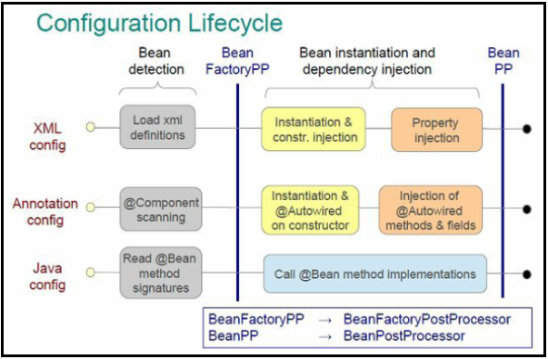
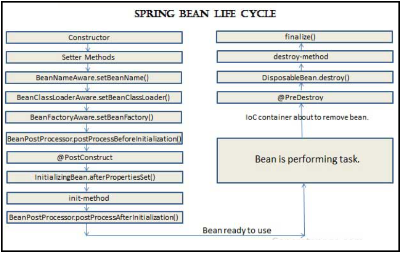

# [←](./README.md) <a id="home"></a> Spring IoC basics

## Table of Contents:
- [Intro](#intro)
- [Application Context](#context)
- [Spring Beans](#beans)
- [Bean scopes](#scopes)
- [Dependency Injection](#injection)
- [Properties injection](#properties)
- [Proxies](#proxy)
- [Spring AOP](#aop)
- [Spring Events](#events)
- [Spring Boot](#boot)

----

## [↑](#home) <a id="intro"></a> Intro
Согласно отчётам **"[Java Developer Productivity Report](https://www.jrebel.com/resources/papers-and-videos)"** от **JRebel**, одной из наиболее популярных "экосистем" для разработки на Java является **Spring Framework**.

Сейчас **Spring Framework** ориентирован на проект **"[Spring Boot](https://docs.spring.io/spring-boot/docs/current/reference/html/getting-started.html#getting-started)"**, поэтому управление необходимыми зависимостями сейчас реализовано тоже по правилам Spring Boot. Spring Boot подключается при помощи специальных плагинов к проектам под управлением разных систем сборок: Maven, Gradle и др.

Части экосистемы Spring при Spring Boot подходе подключаются при помощи **Starters**.\
Со списком стартеров можно ознакомиться в документации: **"[1.5. Starters](https://docs.spring.io/spring-boot/docs/current/reference/html/using.html#using.build-systems.starters)"**.

Стартеры следуют соглашению: имена стартеров начинаются на **spring-boot-starter** и все артефакты принадлежат группе **org.springframework.boot**.

Например, рассмотрим подключение Spring Boot к проекту при помощи системы сборки Maven.\
Для начала нужно описать модель проекта при помощи **pom.xml**. Создадим **[minimal pom](https://maven.apache.org/guides/introduction/introduction-to-the-pom.html#Minimal_POM)**:
```xml
<project>
    <modelVersion>4.0.0</modelVersion>
    <groupId>com.github.veselroger</groupId>
    <artifactId>spring-ioc</artifactId>
    <version>1</version>
</project>
```

Далее необходимо настроить **Dependency management** для экосистемы Spring. Это позволит не указывать версии вручную, чтобы избежать конфликта версий разных модулей Spring. Настройку для Maven можно скопировать из документации: **"[Using Spring Boot without the Parent POM](https://docs.spring.io/spring-boot/docs/current/maven-plugin/reference/htmlsingle/#using.import)"**.

Далее остаётся подключить необходимые стартеры.\
Воспользуемся **"[списком стартеров](https://docs.spring.io/spring-boot/docs/current/reference/html/using.html#using.build-systems.starters)"** из документации и подключим самый базовый стартер **spring-boot-starter**:
```xml
<dependencies>
    <dependency>
        <groupId>org.springframework.boot</groupId>
        <artifactId>spring-boot-starter</artifactId>
    </dependency>
</dependencies>
```
Благодаря объявленному dependency management'у мы не указываем версию, т.к. она будет вычислена автоматически.

При помощи Maven команды ``mvn validate`` можно проверить, что файл описания проекта не содержит ошибок.

Далее нужно подготовить место, где будет java код нашего приложения.\
Структура java проектов в Maven описана в разделе документации **"[Introduction to the Standard Directory Layout](https://maven.apache.org/guides/introduction/introduction-to-the-standard-directory-layout.html)"**. Согласно этому документу Java классы должны лежать в каталоге ``src/main/java``.

Сразу стоит учесть, что **"default package"** (т.е. классы без указания пакета) не рекомендуется использовать. Подробнее про это можно прочитать в документации: **"[2.1. Using the “default” Package](https://docs.spring.io/spring-boot/docs/current/reference/html/using.html#using.structuring-your-code.using-the-default-package)"**.

Таким образом необходимо создать пакет (например, **com.github.veselroger.ioc**). А уже в нём создать java класс с точкой входа в наше приложение:
```java
package com.github.veselroger.ioc;

public class Application {
    public static void main(String[] args) {
        
    }
}
```

Основа **Spring Framework** - **[Spring IoC container](https://docs.spring.io/spring-framework/docs/current/reference/html/core.html#spring-core)**.


## [↑](#home) <a id="context"></a> Application Context
**Inversion of Control (IOC)** - это подход, при котором зависимостями объектов друг от друга управляет кто-то ещё. В нашем случае Spring. Объекты, которыми управляет Spring, называются **Spring Bean**.

Базовая функциональность IOC от Spring представлена при помощи **"[BeanFactory API](https://docs.spring.io/spring-framework/docs/current/reference/html/core.html#beans-beanfactory)"**.

**BeanFactory** - это фабрика Spring Bean'ов. В её задачи не входит полноценное управление жизненным циклом бинов. BeanFactory по большому счёт - это некоторый реестр с бинами, из которого эти бины можно запросить. Такой подход ещё называют **Dependency lookup**. Чтобы получить большое удобство рекомендуется использовать **Application Context**.

Чтобы создать **Application Context** необходимо предоставить Spring Metadata. Существуют разные реализации **Application Context**, каждая из которых конфигурируется по-разному.\
Например, XML конфигурация может быть предоставлена следующим образом:
```java
ApplicationContext context = new ClassPathXmlApplicationContext("services.xml");
```

Начиная со Spring версии 2.5 появилась возможность предоставлять метаданные через аннотации:
```java
ApplicationContext context = new AnnotationConfigApplicationContext(AppConfig.class);
```
На вход конструктор принимает класс, который содержит необходимые аннотации, такие как **@Configuration** или **@Component**. Подробнее описано в разделе документации **"[Instantiating the Spring Container by Using AnnotationConfigApplicationContext](https://docs.spring.io/spring-framework/docs/current/reference/html/core.html#beans-java-instantiating-container)"**, а так же в разделе **"[Basic Concepts: @Bean and @Configuration](https://docs.spring.io/spring-framework/docs/current/reference/html/core.html#beans-java-basic-concepts)"**.

Чтобы без помощи XML описать бины Spring предоставляет так называемые **"[Stereotype Annotations](https://docs.spring.io/spring-framework/docs/current/reference/html/core.html#beans-stereotype-annotations)"**.\
**Stereotype Annotations** - это аннотации, которые описывают определённую роль бина в приложении.\
**@Component** - самый общий стереотип. Данной аннотацией помечаются классы, которые должны быть рассмотрены в качестве Spring Bean. Стереотипы описаны в разделе документации **"[@Component and Further Stereotype Annotations](https://docs.spring.io/spring-framework/docs/current/reference/html/core.html#beans-stereotype-annotations)"**.

Чтобы Spring знал, где искать бины, используется аннотация **[@ComponentScan](https://docs.spring.io/spring-framework/docs/current/reference/html/core.html#beans-scanning-autodetection)**.

Spring Context использует специальные **BeanDefinitionReader**'ы, чтобы используя предоставленные метаданные получить список **Bean Definition**'ов. Bean Definition описывают всю необходимую информацию про Spring Bean. Используя её Spring далее сможет создавать Spring бины в нужное время и в нужном месте.


## [↑](#home) <a id="beans"></a> Spring Beans
Application Context, т.к. является BeanFactory создаёт BeanDefinition'ы и умеет по ним создавать бины. Но главное - он контролирует жизненный цикл бинов. Жизненный цикл бина можно представить следующим образом:



Когда Bean Definition'ы будут подготовлены будут выполнены **[BeanFactoryPostProcessor](https://docs.spring.io/spring-framework/docs/current/reference/html/core.html#beans-factory-extension-factory-postprocessors)**ы, т.е. пост обработка состояния BeanFactory. В этот момент Spring бины ещё не созданы. Самым ярким примером является **PropertySourcesPlaceholderConfigurer**, который является **BeanFactoryPostProcessor** и реализует функционал использования аннотации **"[@Value](https://docs.spring.io/spring-framework/docs/current/reference/html/core.html#beans-value-annotations)"**.

Когда все метаданные Spring бинов готовы, тогда Spring начинает создавать бины и выполнять **[Dependency Injection](https://docs.spring.io/spring-framework/docs/current/reference/html/core.html#beans-factory-collaborators)**. Сначала выполнится создание объекта и Constructor-based injection, а затем Setter-based injection.

Дальше будут выполнены **[BeanPostProcessor](https://docs.spring.io/spring-framework/docs/current/reference/html/core.html#beans-factory-extension-bpp)**ы. Интересно, что одной из реализаций является **AutowiredAnnotationBeanPostProcessor**. Как видно по названию, данный Bean Post Processor обрабатывает аннотацию **[@Autowired](https://docs.spring.io/spring-framework/docs/current/reference/html/core.html#beans-autowired-annotation)**. Не трудно догадаться, что поля, помеченные @Autowired недоступны из конструкторов, т.к. создание объекта происходит раньше, чем Bean Post Processor. Интересная статья на данную тему: **"[Why are my autowired fields null](https://deinum.biz/2020-07-03-Autowired-Field-Null/)"**.

На самом деле жизненный цикл бина несколько больше и выглядит примерно так:



Как видно, существует большое количество дополнительных моментов, когда Spring бин может быть дополнительно обработан при помощи реализации различных **aware** интерфейсов. Их список представлен в разделе документации **"[1.6.3. Other Aware Interfaces](https://docs.spring.io/spring-framework/docs/current/reference/html/core.html#aware-list)"**.

Стоит так же упомянуть, что при создании бинов могут возникнуть циклические зависимости. В случае, если BeanA в конструкторе использует BeanB, а BeanB в конструкторе использует BeanA, то Spring не сможет разрешить такой цикл без помощи разработчика. Самым простым решением будет в одном или нескольких местах использовать аннотацию **@Lazy**, что приведёт к созданию не самого бина, а прокси, через который будет производится доступ к бину. Подробнее см. **"[Circular Dependencies in Spring](https://www.baeldung.com/circular-dependencies-in-spring)"**.

На тему жизненного цикла бина есть отличный материал: **"[Hooking Into the Spring Bean Lifecycle](https://reflectoring.io/spring-bean-lifecycle/)"**.

Говоря про жизненный цикл бинов стоит помнить и про Bean Scope.


## [↑](#home) <a id="scopes"></a> Bean Scopes
У каждого бина есть свой **Bean Scope**.\
Скоупы бинов описаны в разделе документации **"[1.5. Bean Scopes](https://docs.spring.io/spring-framework/docs/current/reference/html/core.html#beans-factory-scopes)"**.

Скоуп бинов указывается при помощи специальной аннотации **[@Scope](https://docs.spring.io/spring-framework/docs/current/reference/html/core.html#beans-scanning-scope-resolver)**:
```java
@Component
@Scope(ConfigurableBeanFactory.SCOPE_PROTOTYPE)
public class Message {
```

По умолчанию скоуп у бинов - **Singleton**. Это означает, что бин создаётся один раз при запуске контекста и остаётся под управлением Spring до конца своей жизни, т.е. всей жизнью бина управляет Spring.

В противовес ему есть скоуп - **Prototype**. Жизненным циклом такого бина Spring управляет только до тех пор, пока бин полностью не инициализирован. Как только бин отдаётся в код на использование, Spring перестаёт следить за таким бином. Это важно понимать, т.к. **@PreDestroy** для таких бинов не будет работать, т.к. никто больше не следит за жизнью бина. Для этого можно рассмотреть написание небольшого workaround с применением **Cleaner'а**. Подробнее про Cleaner'а можно прочитать здесь: **"[Time to say goodbye to the finalize method in Java](https://medium.com/javarevisited/time-to-say-goodbye-to-the-finalize-method-in-java-a2f5b7e4f1b1)"**. Например, Cleaner можно тоже создать как бин:
```java
@Bean
public Cleaner cleaner() {
    return Cleaner.create();
}
```

Может возникнуть вопрос, как использовать бины меньшего скоупа (например, prototype) в бинах с более долгим scope (например, singleton). Ответ есть в документации Spring: **"[1.11.1. Dependency Injection with @Inject and @Named](https://docs.spring.io/spring-framework/docs/current/reference/html/core.html#beans-inject-named)"**. Для этих целей можно использовать или **javax.inject.Provider** или **org.springframework.beans.factory.ObjectProvider**:
```java
@Autowired
private ObjectProvider<ExampleBean> objectProvider;
```
Подробнее про согласование бинов с разными scope можно прочитать здесь: **"[The problem of injecting a shorter-lived scoped bean into a longer-lived scoped bean](https://www.logicbig.com/tutorials/spring-framework/spring-core/injecting-singleton-with-prototype-bean.html)"**.


## [↑](#home) <a id="injection"></a> Dependency Injection
Поговорив про Application Context и скоупы стоит разобраться с тем, какие есть способы Dependency Injection в Spring. Об этом хорошо рассказано в документации Spring: **"[1.4.1. Dependency Injection](https://docs.spring.io/spring-framework/docs/current/reference/html/core.html#beans-factory-collaborators)"**.

Есть несколько способов Dependency Injection: 
- на основе конструктора (Constructor-based)
- на основе сеттеров (Setter-based)
- Field Injection

Для управления Dependency Injection используется аннотация **[@Autowired](https://docs.spring.io/spring-framework/docs/current/reference/html/core.html#beans-autowired-annotation)**.

Кроме этого, существует спецификация **"JSR 330: Dependency Injection"**, которая описывает JEE стандарт Dependency Injection. Данная спецификация вводит другие аннотации, выполняющие те же функции. Spring позволяет в том числе использовать и эти анотации. Например, можно использовать **@Inject** вместо **@Autowired**. Подробнее см. в документации: **"[Using JSR 330 Standard Annotations](https://docs.spring.io/spring-framework/docs/current/reference/html/core.html#beans-standard-annotations)"**.

**[Constructor based injection](https://docs.spring.io/spring-framework/docs/current/reference/html/core.html#beans-constructor-injection)** использует конструктор, чтобы инициализировать бин. Аргументы, используемые в аргументах конструктора, будут найдены, инициализированы в качестве бинов и подставлены в конструктор. При наличии только одного конструктора нет необходимости указывать аннотацию.

Благодаря аннотации @Autowired мы можем иметь один конструктор без аргументов и БЕЗ аннотаций, а второй конструктор объявить следующим образом:
```java
@Autowired(required = false)
public TestComponent(StringBuilder sb) {
    this.sb = sb;
}
```
Если Spring поймёт, что у него нет бина с типом StringBuilder, то он воспользуется конструктором по умолчанию. Важно помнить, что нельзя аннотировать @Autowired'ом более одного конструктора.

**[Setter-based injection](https://docs.spring.io/spring-framework/docs/current/reference/html/core.html#beans-setter-injection)** советуют использовать для опциональных зависимостей. Стоит обратить внимание, что для setter based injection мы должны явно аннотировать такие методы при помощи **@Autowired**, в противном случае сеттеры не будут вызваны Spring'ом.

**Field injection** используется в случаях, когда аннотацией **@Autowired** отмечены поля.

Чтобы понять, какой бин куда подставлять Spring задаёт для каждого бина его **Bean Name**. В случае аннотации над классом - бин будет называться по имени класса. Если бин был создан через метод - тогда названием бина будет название метода.

**Как работает @Autowired:** \
Сначала Spring выбирает бины-кандидаты по типу. Далее, если кандидатов оказалось несколько - Spring пытается найти среди них нужный по **qualifier**. По умолчанию, Spring считает Bean Name в качестве квалификатора по умолчанию, если иное не указано при помощи **@Qualifier**.

Подробнее про квалификаторы можно прочитать в разделе документации **"[1.9.4. Fine-tuning Annotation-based Autowiring with Qualifiers](https://docs.spring.io/spring-framework/docs/current/reference/html/core.html#beans-autowired-annotation-qualifiers)"**, а так же в статье **"[The Spring @Qualifier Annotation](https://www.baeldung.com/spring-qualifier-annotation)"**.

Spring позволяет создавать собственные квалификаторы: **"[Достоинство @Qualifier](http://spring-projects.ru/blog/a-quality-qualifier/)"**.

Кроме квалификаторов для разрешения неоднозначности можно использовать аннотацию **@Primary**. Подробнее можно прочитать в документации: **"[Fine-tuning Annotation-based Autowiring with @Primary](https://docs.spring.io/spring-framework/docs/current/reference/html/core.html#beans-autowired-annotation-primary)"**.

**Self injection** - интересный случай inject'а бина самого в себя. Документация говорит, что "Note that self injection is a fallback". Это означает, что бин, который выполняет inject сам в себя будет рассмотрен в самую последнюю очередь и не участвует в "regular candidate selection" и не может быть Primary. Рекомендуется избегать такого кроме крайних случаев, вроде вызова методов, которые помечены транзакционными аннотациями. Рекомендуется использовать аннотацию @Resource и получение по уникальному имени бина.


## [↑](#home) <a id="properties"></a> Properties injection
Как ранее было сказано, Application Context благодаря использованию **BeanFactoryPostProcessor**ов, а именно благодаря **PropertySourcesPlaceholderConfigurer** позволяет по аналогии с Dependency Injection получать значения property.

Подробнее про этот механизм можно прочитать в разделе документации **"[1.9.8. Using @Value](https://docs.spring.io/spring-framework/docs/current/reference/html/core.html#beans-value-annotations)"**. 

В документации Spring Boot этому выделен отдельный раздел: **"[2. Externalized Configuration](https://docs.spring.io/spring-boot/docs/current/reference/html/features.html#features.external-config)"**.

Рассмотрим небольшой пример применения аннотация **@Value**:
```java
@Configuration
@PropertySource("classpath:application.properties")
public class AppConfig { }
```

А дальше остаётся лишь получить значение. Например:
```java
@Value("${value.from.file}")
private String valueFromFile;
```


## [↑](#home) <a id="proxy"></a> Proxies
Spring активно использует механизм проксирования для реализации **Dependency Injection**.

Например, механизм проксирования может применяться при использовании аннотации **@Lazy** для "ленивой" инициализации бинов (т.к. в этом случае нужно создавать бин не создавая его). В таком случае создаётся прокси, а сам объект, который будет проксироваться, будет создан уже при обращении к прокси.

Spring использует 2 типа проксирования: **Dynamic Proxy**, а иначе будет использован **Spring CGLIB**.\
**CGLIB** - это Byte Code Generation Library.\
Проксирование через Dynamic Proxy более "легковесно", но может работать **ТОЛЬКО** через интерфейсы.\
Если указанный тип НЕ является интерфейсом, то Spring будет использовать **Spring CGLIB**.

Говоря про прокси стоит вернуться к разделу документации **"[1.12.1. Basic Concepts: @Bean and @Configuration](https://docs.spring.io/spring-framework/docs/current/reference/html/core.html#beans-java-basic-concepts)"** и описанию того, что такое **"lite @Bean mode"**.

Component Scan зарегистрирует как @Component, так и @Configuration. Но есть разница. Как сказано в документации, методы с аннотацией @Bean в классах, **НЕ** помеченных как @Configuration обрабатываются в так называемом **Lite mode**. А классы, помеченные **@Configuration** работают в специальном режиме, который называется **"full mode"**.

Как сказано, в Full Mode вызов методов, которые отмечены @Bean и которые расположены в @Configuration классах, перенаправляется контейнеру. Это позволяет избежать случайного вызова методов и создания новых экземпляров. То есть такие методы вызываются через Proxy, т.к. именно прокси 

Более подробно можно прочитать в разделе документации **"[1.10.5. Defining Bean Metadata within Components](https://docs.spring.io/spring-framework/docs/current/reference/html/core.html#beans-factorybeans-annotations)"**.

Из документации так же ясно, что если метод, аннотированный @Bean, статический - то такой метод не проксируется, даже если он указан в классе @Configuration, т.к. это ограничение CGLIB (т.к. CGLIB проксирует ТОЛЬКО методы, которые НЕ static).

Предположим, у нас есть такое описание бина:
```java
@Bean
public String path(TestComponent cmp) {
    String className = cmp.getClass().getCanonicalName();
    System.out.println("Injected class:" + className);
    return className;
}
```

То, будет ли проксирован cmp, переданный в конструкторе, зависит от того, что такое cmp. Если cmp - это просто POJO, то проксирования вообще не будет (т.к. за ним не нужно следить и особо ухаживать за ним). Однако, если мы поставим **@Lazy** перед аргументом, то Spring должен будет создавать настоящий бин только при обращение к методам данного бина. Т.к. нельзя иметь бин не создав его, то мы должны создать proxy, который будет скрывать от нас факт того, есть ли бин на самом деле или ещё нет. Если указанный тип является интерфейсом, то Spring использует **Dynamic Proxy**, а иначе будет использован **Spring CGLIB**.

Кроме того, некоторые аннотации могут приводить к тому, что будет создан прокси. Например, если в классе/интерфейсе есть аннотация **@Transactional** над каким-нибудь методом, то для управления транзакциями Spring создаст CGLIB прокси.

Про механизм проксирования так же рекомендуется к ознакомлению:
- Spring Documenation: **"[5.8. Proxying Mechanisms](https://docs.spring.io/spring-framework/docs/current/reference/html/core.html#aop-proxying)"**.
- **[Marco Behler:Spring & CGLIB: Finally Understandable](https://www.youtube.com/watch?v=hskHMSlvm6U)**


## [↑](#home) <a id="aop"></a> Spring AOP
Spring активно использует подход, который называется **Aspect-oriented programming (AOP)**.

**Aspect-oriented programming** - это программирование при помощи **аспектов**, позволяющее реализовывать сквозную функциональность. Это позволяет вынести прямую зависимость от этой сквозной функциональности ИЗ классов. Например, функциональность логирования или поддержки транзакций может быть вынесена из метода в аспект. Аспект вызывается не напрямую из метода, а при помощи **AOP**.

**Aspect** - это класс, который содержит логику, которая "пронизывает" (cuts across) другие классы.

**Joinpoint** - некоторая точка, в которой необходимо присоединить аспект. В Spring AOP это всегда метод.

**Advice** - это некоторое "уведомление" (слово Advice переводится и так тоже), т.е. когда уведомлять, что нужно применить аспект. Существуют разные advice, например: "around" (во время вызова), "before" и "after" (до и после вызова соответствующе).

**Pointcut** - предикат, который отвечает на вопрос, нужно ли применять advice к указанной joint point.

Spring поддерживает два типа описание аспектов: **"[@AspectJ](https://docs.spring.io/spring-framework/docs/current/reference/html/core.html#aop-ataspectj)"** и более низкоуровневый **"[Spring AOP APIs](https://docs.spring.io/spring-framework/docs/current/reference/html/core.html#aop-api)"**.

Пример использования @AspectJ можно посмотреть в статье **"[Spring AOP Example Tutorial](https://www.digitalocean.com/community/tutorials/spring-aop-example-tutorial-aspect-advice-pointcut-joinpoint-annotations)"**.

В качестве примера применения AOP часто можно увидеть использование транзакций через аннотацию **@Transactional**.\
Более подробно описано в статье **"[How Does Spring @Transactional Really Work?](https://dzone.com/articles/how-does-spring-transactional)"**.\
Аспект управления транзакциями - это advice типа **[around](https://docs.spring.io/spring-framework/docs/current/reference/html/core.html#aop-api-advice-around)** и реализован он при помощи класса **TransactionInterceptor**.

**[TransactionInterceptor](https://github.com/spring-projects/spring-framework/blob/main/spring-tx/src/main/java/org/springframework/transaction/interceptor/TransactionInterceptor.java#L112)** - это Spring бин, который реализует **[org.aopalliance.intercept.MethodInterceptor](org.aopalliance.intercept.MethodInterceptor)**.


## [↑](#home) <a id="events"></a> Spring Events
В процессе работы Spring возникают различные события, т.е. Events.\
Про Spring Events можно прочитать в статье **"[Spring Events](https://www.baeldung.com/spring-events)"**.

Кроме этого, событиям в Spring Framework отведён специальный раздел документации: **"[1.15.2. Standard and Custom Events](https://docs.spring.io/spring-framework/docs/current/reference/html/core.html#context-functionality-events)"**.

Spring позволяет слушать эти события:
```java
@Component
public class TestComponent {
    @EventListener
    public void handleContextStart(ContextStoppedEvent cse) {
        System.err.println("Handling context started event.");
    }
}
```
Интересно, что можно создавать собственные события. Подробнее можно прочитать в материале **"[Spring Boot Application Events Explained](https://reflectoring.io/spring-boot-application-events-explained/)"**.


## [↑](#home) <a id="boot"></a> Spring Boot
Со временем экосистема Spring выработала подход **Convention Over Configuration Mean**, который был реализован при помощи Spring Boot.\
Идея Spring boot в том, что используя сведения о том, что лежит на classpath предоставлять базовую функциональность с минимальным количеством настроек (т.е. предоставлять для большинства настроек дефолты).

Т.к. настройки кто-то должен сделать, то и запуск приложения стал выполняться по-другому, при помощи **[SpringApplication.run](https://docs.spring.io/spring-boot/docs/current/reference/htmlsingle/#features.spring-application)**. В качестве аргумента в общем случае необходимо передавать класс, аннотированный **[@SpringBootApplication](https://docs.spring.io/spring-boot/docs/current/reference/htmlsingle/#using.using-the-springbootapplication-annotation)**.

Тут стоит отметить, что аннотация **@SpringBootApplication** включает себя аннотацию **@SpringBootConfiguration**. Это тоже самое, что и **@Configuration**, однако предполагает, что это главная конфигурация. Это утверждение используется Spring Test framework при поднятии Spring контекста для тестов.

Кроме того, Spring Boot приложение настраивается при помощи специальных файлов.\
Более подробно см. раздел документации **"[7.2.3. External Application Properties](https://docs.spring.io/spring-boot/docs/current/reference/htmlsingle/#features.external-config.files)"**.

Стоит так же отметить, что при запуске Spring Boot приложения создаётся не только Application Context, но и на время запуска создаётся **[Bootstrap Context](https://docs.spring.io/spring-boot/docs/current/api/org/springframework/boot/BootstrapRegistry.html)**. Данный контекст может быть использован различными частями Spring инфраструктуры, такими как **[Spring Cloud](https://www.baeldung.com/spring-cloud-bootstrap-properties)**.

Простейший пример Spring Boot приложения:
```java
@SpringBootApplication
public class Application {

    public static void main(String[] args) {
        SpringApplication.run(Application.class, args);
    }
}
```


## [↑](#home) <a id="resources"></a> Resources
Дополнительные материалы:
- **[Annotation Support for Scheduling and Asynchronous Execution](https://docs.spring.io/spring-framework/docs/current/reference/html/integration.html#scheduling-annotation-support)**
- **[Урок 2: Введение в Spring IoC контейнер](http://spring-projects.ru/guides/lessons/lesson-2/)**
- **[Using Spring Boot](https://docs.spring.io/spring-boot/docs/current/reference/html/using.html#using)**